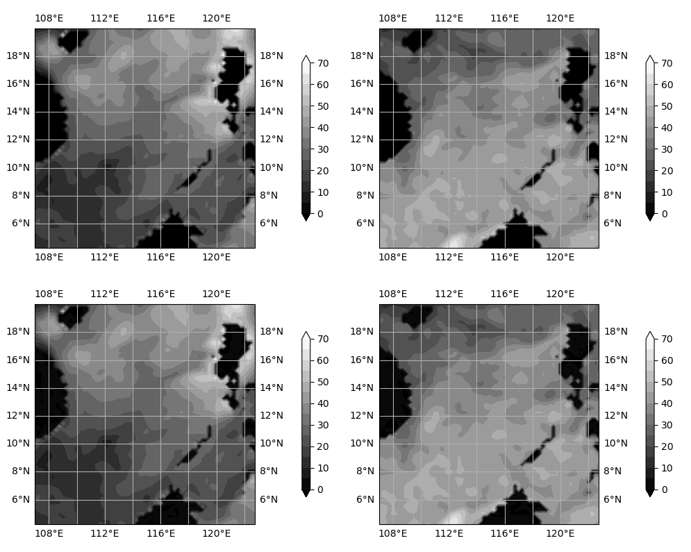

### UNet style model for Evaparation Duct Height Diagnosis
This for a model for evaparation duct height regression and is named EDH-R-UNet. Use this model, you can diagnose large-scale evaparation duct height fast. The performance is shown in the following figure.

The pictures in first line are the physical model diagnosis results, and the second line shows the EDH-R-UNet diagnosis results. Almost same! Quantitative test indicators are shown in the table below.

| Model         | RMSE    | MAE     | MedAE   | RS      | Time        |
|:-------------:|:-------:|:-------:|:-------:|:-------:|:-----------:|
| EDH-R-Unet    | 0.13707 | 0.06328 | 0.04284 | 0.99990 | 8.836329222 |
| XGBoost       | 1.91156 | 1.72198 | 1.94468 | 0.98209 | 18.75347781 |
| Random Forest | 5.49788 | 4.88819 | 5.53391 | 0.77509 | 16.23335242 |

Before running this project, you should have dataset (not yet upload, too big 😓)

Q: How to train a EDH-R-UNet?

A: `python scripts/unet/train_unet.py`

Q: How to test the trained EDH-R-UNet?

A: `python scripts/unet/test_unet.py`
